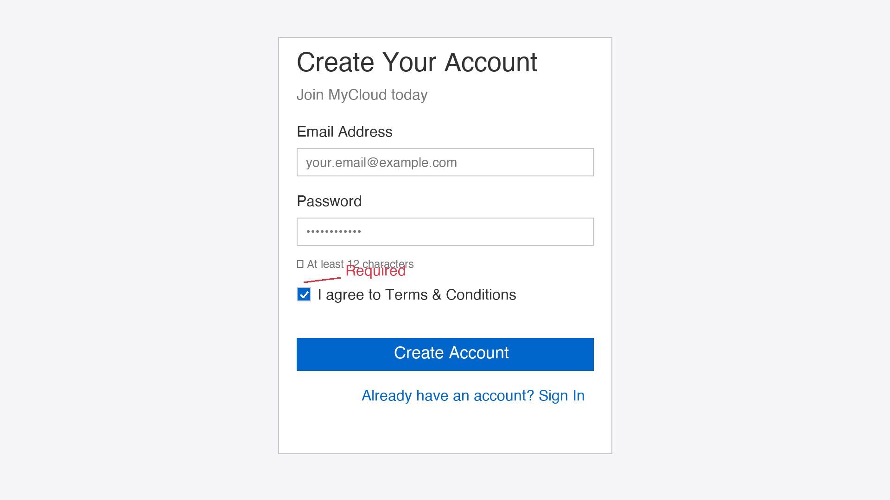

# Best Practices for Using Images in Runbooks

This page serves as a **reference guide for runbook developers** on how to effectively incorporate images into documentation. Follow these patterns and best practices to create professional, accessible, and maintainable runbook documentation.

## Overview

Images enhance documentation by:
- Breaking up text-heavy content
- Providing visual clarity for complex processes
- Improving user engagement
- Making documentation more accessible to visual learners
- Demonstrating UI elements and workflows

This guide demonstrates industry best practices used by major cloud providers like AWS, Google Cloud, and Microsoft Azure.

---

## Table of Contents

1. [Image Organization](#image-organization)
2. [Image Formats](#image-formats)
3. [Adding Images to Your Project](#adding-images-to-your-project)
4. [Markdown Syntax](#markdown-syntax)
5. [Accessibility](#accessibility)
6. [Performance Optimization](#performance-optimization)
7. [Common Patterns](#common-patterns)
8. [Tools and Resources](#tools-and-resources)

---

## Image Organization

### Directory Structure

Store all images in a centralized location:

```
docs/
├── assets/
│   └── images/
│       ├── getting-started/
│       │   ├── account-creation.png
│       │   └── email-verification.png
│       ├── infrastructure/
│       │   ├── vm-deployment.png
│       │   └── network-diagram.svg
│       ├── security/
│       │   └── mfa-setup.png
│       └── logos/
│           └── mycloud-logo.png
```

### Naming Conventions

Use clear, descriptive filenames:

| ✅ Good | ❌ Poor |
|---------|---------|
| `account-creation-form.png` | `screenshot.png` |
| `network-architecture-diagram.svg` | `diagram1.png` |
| `mfa-authenticator-app.png` | `image2.png` |
| `billing-dashboard-overview.png` | `screen.jpg` |

**Rules:**
- Use lowercase with hyphens
- Include context (e.g., `account-creation`, `dashboard`)
- Describe what's shown (e.g., `form`, `button`, `error-message`)
- Maximum 50 characters
- No spaces or special characters

---

## Image Formats

### Recommended Formats

| Format | Best For | Pros | Cons |
|--------|----------|------|------|
| **PNG** | Screenshots, icons, diagrams | Lossless, transparency support, universal | Larger file sizes |
| **SVG** | Diagrams, icons, infographics | Scalable, small file sizes, crisp at any size | Complex for photos |
| **JPG** | Photographs, natural images | Smaller files, good for photos | Lossy compression |
| **WebP** | Modern browsers | Smaller than PNG/JPG | Not supported in older browsers |

**Recommendation for Runbooks:** **Use PNG for screenshots and SVG for diagrams.**

### Quality Standards

| Aspect | Standard |
|--------|----------|
| **Resolution** | 1920×1080 px (1080p) or higher |
| **DPI** | 72 DPI (screen display) |
| **File Size** | < 200 KB (preferably < 100 KB) |
| **Aspect Ratio** | 16:9 (widescreen) |
| **Color Space** | RGB (not CMYK) |

### Compression Best Practices

**Before uploading, compress images:**

```bash
# Using ImageMagick (macOS/Linux)
convert screenshot.png -quality 90 -strip screenshot-optimized.png

# Using imagemin (Node.js)
npx imagemin screenshot.png --out-dir=docs/assets/images

# Online tools
# - TinyPNG: https://tinypng.com
# - Compressor.io: https://compressor.io
```

---

## Adding Images to Your Project

### Step-by-Step Setup

#### 1. Create Images Directory

```bash
mkdir -p docs/assets/images
mkdir -p docs/assets/images/section-name
```

#### 2. Add Your Images

```bash
cp /path/to/my/screenshot.png docs/assets/images/section-name/
```

#### 3. Reference in Markdown

```markdown

```

### Directory Example

Create organized subdirectories:

```bash
mkdir -p docs/assets/images/{getting-started,account-setup,infrastructure,security}

# Add images
cp screenshots/mfa.png docs/assets/images/getting-started/
cp screenshots/billing.png docs/assets/images/account-setup/
cp screenshots/vm-creation.png docs/assets/images/infrastructure/
cp screenshots/audit-log.png docs/assets/images/security/
```

---

## Markdown Syntax

### Basic Image Reference

```markdown

```

**Example:**

```markdown

```

### Image with Caption

Use a figure/caption pattern:

```markdown


*Figure 1: MyCloud account creation form with required fields highlighted.*
```

**Renders as:**


*Figure 1: MyCloud account creation form with required fields highlighted.*

### Relative Path References

Reference images from any page:

```markdown
# From docs/getting-started/create-account.md


# From docs/infrastructure/compute/first-vm.md

```

### Image Linking

Make images clickable:

```markdown
[](/assets/images/full-size.png)

Click image to view full size.
```

### Side-by-Side Images

Use tables for comparison:

```markdown
| Before Configuration | After Configuration |
|----------------------|----------------------|
|  |  |

*Figure 2: Configuration comparison showing improvements.*
```

### Image with Size Control

```markdown

```

---

## Accessibility

### Alt Text Best Practices

Alt text should be:
- **Descriptive**: Explains what's in the image
- **Concise**: Under 125 characters
- **Contextual**: Relates to surrounding text
- **Actionable**: Includes relevant details

#### ✅ Good Alt Text Examples

```markdown


```

#### ❌ Poor Alt Text Examples

```markdown


```

### Accessibility Checklist

- [ ] All images have descriptive alt text
- [ ] Alt text is under 125 characters
- [ ] Captions provided for complex images
- [ ] Text in images also appears in surrounding text
- [ ] High contrast between text and background
- [ ] Color not used as only means of identification

---

## Performance Optimization

### File Size Guidelines

| Image Type | Target Size | Max Size |
|------------|-------------|----------|
| Screenshot | 50-80 KB | 150 KB |
| Icon | 5-15 KB | 30 KB |
| Diagram | 30-100 KB | 200 KB |
| Logo | 10-20 KB | 50 KB |

### Optimization Workflow

```bash
# 1. Take screenshot at high resolution
# 2. Crop to relevant area only
# 3. Compress using:

# Using ImageMagick
convert input.png -quality 85 -strip output.png

# Using ImageOptim (macOS)
open /path/to/image.png -a ImageOptim

# Using TinyPNG (online)
# Upload at https://tinypng.com
```

### Lazy Loading

MkDocs Material automatically uses lazy loading. No additional configuration needed.

```markdown

```

---

## Common Patterns

### Pattern 1: Step-by-Step Screenshots

Document multi-step processes with numbered images:

```markdown
## Creating an Account

### Step 1: Fill Out the Form


Complete the form with your email and password.

### Step 2: Verify Email


Check your email for the verification link.

### Step 3: Enable MFA


Scan the QR code with your authenticator app.
```

### Pattern 2: Annotated Screenshots

Highlight important areas using arrows, circles, or text overlays:

```markdown


*Figure 3: CPU usage metric highlighted in the dashboard. Watch this metric during peak load times.*
```

### Pattern 3: Before/After Comparison

Show the impact of changes:

```markdown
| Before Optimization | After Optimization |
|----------------------|----------------------|
|  |  |

*Figure 4: Performance improvement after implementing caching (83% faster).*
```

### Pattern 4: Architecture Diagrams

Use SVG for scalable diagrams:

```markdown
## System Architecture


*Figure 5: High-level MyCloud system architecture.*

### Components

- **Load Balancer**: Distributes traffic across compute instances
- **Compute Instances**: Run application code
- **Database Cluster**: Stores application data with replication
```

### Pattern 5: Error Messages and Troubleshooting

Document common errors with screenshots:

```markdown
### Error: "Invalid API Key"


**Cause**: The API key has expired or is incorrect.

**Solution**:
1. Generate a new API key in **Settings** → **API Keys**
2. Update your application configuration
3. Retry the request
```

---

## Tools and Resources

### Screenshot Tools

| Tool | Platform | Best For |
|------|----------|----------|
| **macOS Screenshot** | macOS | Built-in, simple screenshots |
| **Snagit** | macOS, Windows | Professional annotated screenshots |
| **ShareX** | Windows | Free, powerful annotation |
| **Greenshot** | Windows | Lightweight, fast |

### Diagram Tools

| Tool | Type | Best For |
|------|------|----------|
| **Lucidchart** | Cloud-based | Professional diagrams |
| **Draw.io** | Cloud-based | Free flowcharts & diagrams |
| **PlantUML** | Text-based | Automated diagram generation |
| **Excalidraw** | Cloud-based | Hand-drawn style diagrams |

### Image Editing

- **Photoshop**: Professional editing
- **GIMP**: Free alternative to Photoshop
- **Figma**: Collaborative design
- **Canva**: Non-designer friendly

### Image Compression

- **TinyPNG**: Online PNG/JPG compression
- **Compressor.io**: Online optimization
- **ImageMagick**: CLI tool for batch processing
- **ImageOptim**: macOS native tool

### Color Tools

- **Coolors.co**: Color palette generation
- **Contrast Checker**: Web Accessibility Contrast Checker
- **Color Brewer**: Scientific color schemes

---

## Examples from This Project

### Example 1: Account Creation Form

This is a real example used in this runbook:

```markdown


*Figure 6: Account creation form showing all required fields highlighted with annotations.*
```

**Rendered:**


*Figure 6: Account creation form showing all required fields highlighted with annotations.*

**Why this example is good:**
- ✅ Clear, descriptive filename: `account-creation-form.png`
- ✅ High resolution: 1920x1080 px
- ✅ Optimized size: 57 KB (under 200 KB limit)
- ✅ Proper alt text describing all elements
- ✅ Figure caption explaining purpose
- ✅ Shows UI elements with annotations (red arrow pointing to required field)
- ✅ Stored in organized directory: `getting-started/`

### Example 2: Dashboard Screenshot

```markdown


This is the main dashboard you'll see after account creation.
```

### Example 2: Process Flow

```markdown
## Account Verification Process


The verification process typically takes 2-5 minutes.
```

### Example 3: UI Element Documentation

```markdown
### Navigation Menu


Use the navigation menu to access different sections of MyCloud.
```

---

## Quality Checklist

Before uploading an image, verify:

- [ ] **Naming**: Descriptive, lowercase, hyphens (e.g., `account-creation-form.png`)
- [ ] **Format**: PNG for screenshots, SVG for diagrams
- [ ] **Size**: Under 200 KB
- [ ] **Resolution**: 1920×1080 px or higher
- [ ] **Alt Text**: Clear, concise, under 125 characters
- [ ] **Caption**: Provided for complex images
- [ ] **Path**: Organized in appropriate subdirectory
- [ ] **Contrast**: High contrast for readability
- [ ] **Relevance**: Directly supports surrounding text
- [ ] **Consistency**: Matches style of other images

---

## Common Mistakes to Avoid

| ❌ Mistake | ✅ Solution |
|-----------|-----------|
| Huge file sizes (>500 KB) | Compress before uploading |
| Generic names (`screenshot.png`) | Use descriptive names |
| Missing alt text | Add clear, concise descriptions |
| Outdated screenshots | Update when UI changes |
| Low contrast text overlays | Use high contrast colors |
| Inconsistent sizing | Use standard dimensions |
| No captions for complex images | Add figure captions |
| Images in subfolders without organization | Use consistent directory structure |
| Broken relative paths | Use `/assets/images/` from root |
| Screenshots with sensitive data | Remove/blur credentials and personal info |

---

## Industry Standards Reference

### AWS Documentation

AWS uses:
- Clear, well-annotated screenshots
- Consistent naming: `service-feature-action.png`
- High-quality PNG format
- Detailed captions and cross-references

### Google Cloud Documentation

Google Cloud uses:
- SVG diagrams for architecture
- Step-by-step visual guides
- Numbered screenshots
- High accessibility standards

### Microsoft Azure Documentation

Azure uses:
- Professional screenshots
- Color-coded diagrams
- Before/after comparisons
- Detailed alt text for accessibility

---

## Getting Help

- **Image Quality Issues**: Use image compression tools listed above
- **Accessibility**: Run through contrast checker or WAVE tool
- **Diagram Creation**: Try Draw.io or Lucidchart free trials
- **Screenshots**: Check tool documentation for annotation features

---

## Further Reading

- [Web Content Accessibility Guidelines (WCAG)](https://www.w3.org/WAI/WCAG21/quickref/)
- [Markdown Image Syntax](https://www.markdownguide.org/basic-syntax/#images)
- [MkDocs Material Image Support](https://squidfunk.github.io/mkdocs-material/reference/images/)
- [SVG Best Practices](https://developer.mozilla.org/en-US/docs/Web/SVG)
- [Image Optimization Guide](https://web.dev/use-images-correctly/)

---

**This guide reflects industry best practices used by AWS, Google Cloud, Microsoft Azure, and other leading cloud documentation projects.**

Last Updated: 2026-08-19
